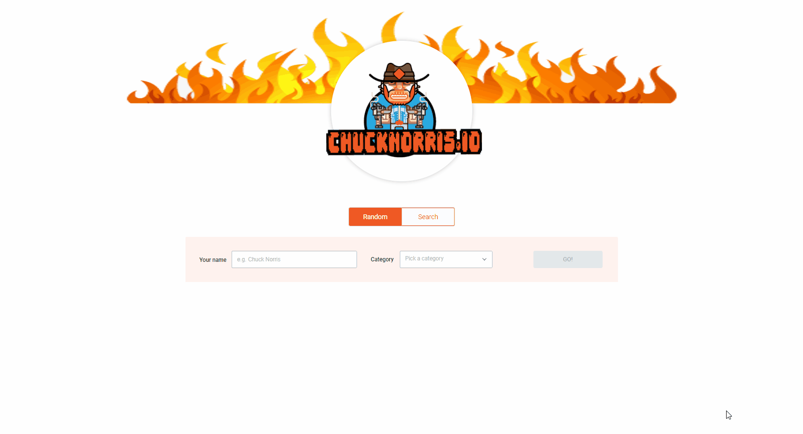

# Kryon task

This project is generating fun jokes based on the legendary Chuck Norris.

## Summary

  - [Angular version](#angular-version)
  - [Technologies used in project](#technologies-used-in-project)
  - [Installing](#installing)
  - [Running unit tests](#running-unit-tests)
  - [Author](#author)
  - [Live demo](#live-demo)

## Angular version

This project was generated with [Angular CLI](https://github.com/angular/angular-cli) version 11.1.2.

## Technologies used in project

This project uses:
  - [Akita state managment](https://datorama.github.io/akita/)
  - [rxjs](https://rxjs.dev/guide/overview)
  - [css bem methodology](http://getbem.com/introduction/)
  - Angular routing (lazy loaded)
  - [Angular Material](https://material.angular.io/)
  - Karma unit testing

### Installing

First, install the required packages:

    npm install

Then run the project

    ng serve

## Running unit tests

   
  Run uts by

    ng test

## Author

  Natan Azulay

## Live Demo

  
